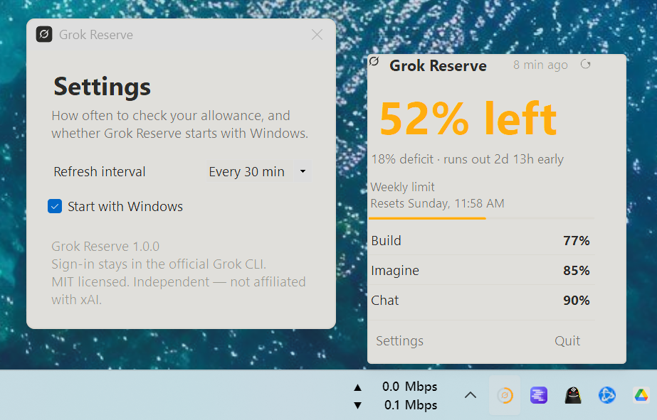

# Grok Reserve

A lean, self-contained Windows tray app that shows how much Grok subscription
capacity you have left.



The tray icon is the Grok mark with a ring around it. The ring is the **SuperGrok
weekly pool** (Chat, Imagine, Voice, Build, Automations). Green means reserve or
on pace; orange means deficit or exhausted. Hover for the tooltip. Click for
the dashboard.

The dashboard also shows **Grok Bot** when that app is signed in on this PC.
Bot has its own weekly limit and its own reset. It does not spend the SuperGrok
pool. grok.com shows percent **used**; Reserve shows percent **left**.

## You need this first

Grok Build must be installed, and you must already be signed in:

```powershell
grok login
```

Grok Reserve reads `%USERPROFILE%\.grok\auth.json`. It does not have its own
account.

The Bot meter also needs the Grok Bot desktop app, signed in, on the same
Windows user. Reserve does not ask for a second password. It uses the session
Bot already stored.

## Build a single self-contained exe

```powershell
dotnet publish -c Release -r win-x64 --self-contained true -p:PublishSingleFile=true -p:IncludeNativeLibrariesForSelfExtract=true -p:EnableCompressionInSingleFile=true
```

The exe lands in `bin\Release\net8.0-windows\win-x64\publish\GrokReserve.exe`.

A ready-made build is on [Releases](https://github.com/SunofWisdom/Grok-Reserve/releases). See [CHANGELOG](CHANGELOG.md) for what changed.

## Run from source

```powershell
dotnet run
dotnet run -- --demo
```

`--demo` shows sample data without talking to Grok.

## Start with Windows

Settings → **Start with Windows**. That writes a per-user Run key to the current
exe path. If you move the exe, toggle the option off and on again.

## Independence

Independent project, MIT licensed. Not affiliated with xAI.

Windows port of the idea behind [Reserve](https://github.com/pocarles/reserve) by Pierre-Olivier Carles.
